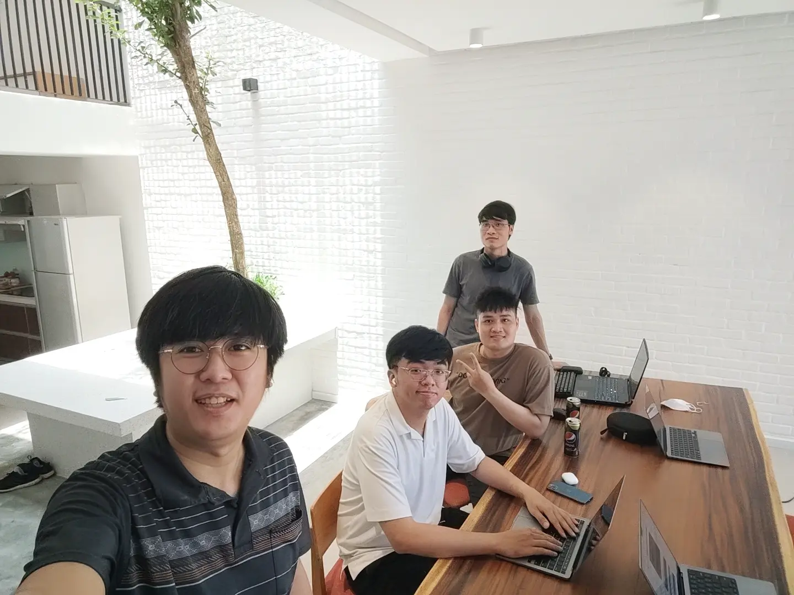

**Life at Dwarves #6** is all about how Hieu Vu ([@vdhieu](https://github.com/vdhieu)) picked up Golang as his favorite programming, and how human factor happens to be the key element that ties him with Dwarves.

[@vdhieu](https://github.com/vdhieu) is currently a Backend Engineer, who was formerly an intern at KMS Technology Corporation. Through Aharooms project, his interest for Golang began. After 3 years, it’s not just the programming language that he was fond of, but also the human and culture at Dwarves that led to his decision: To go further with Dwarves for its human and the exclusive learning culture.

### Python, Java or NodeJS? Golang!
“Back in 2017, Japanese companies were highly rated. People strived to go for it. Of course, I wasn't an exception. I tried my luck by applying for a Japanese tech firm. They required an entrance test using the Golang language, which I had no idea about. They gave us a 1-week deadline to learn and complete the exercise. I failed, obviously. But I had no regret. That test, by all means, sparked my lucky charm with Golang.

I started working on the Aharooms project before eventually moving on to Dwarves. I was able to learn more about NodeJS, but it was Aharooms that gave me the chance to learn and practice Golang. The excitement escalated, and I knew this should be my go-to language. 

Why not Python or Java? The simplicity and efficiency I found in Golang are unbeatable. The language granted me the joy to work with, and empowered my productivity. It was beyond any language I've ever been with. 

From what I concept, Golang's future development is very promising, as more and more companies and startups incorporate Golang into their projects. More specifically, Go's adaptability is ideal for creating and developing cloud-native applications. 

It was indeed a bit confusing when you first approached a new language. The willingness to learn, and the time spent to find a solution matter a lot. Don't force yourself if you have explored and practiced with a programming language and don't enjoy working with it. Find the language you love, and seek projects in which you can participate all you've learned.”

### It’s normal to be ‘inexperienced’.
"Even though I am an instructor for interns, I often see and refer to myself as a supporter. Most interns have quite a bit of prior experience, and I need to hone my skills to become a better mentor. 

Another issue I discovered is that recently, fresh graduates are afraid to apply to large corporations due to their lack of experience. But it's normal to be inexperienced! The important thing is the knowledge you acquired during school. 

Use that as your confidence to gain your first job." Stay hungry, and stay foolish. At the same time, ask yourself what type of person you want to be in the future. Whether being an "indie hacker" or a self-employed, you should constantly improve your skills and industry expertise, as well as network to expand relationships.”

### It's the people and its culture that keep me at Dwarves.
"During my internship at KMS in 2017, only two people were on the team: The leader and I. As everything was already built, our daily job was to maintain the application. After a month, the leader thought I could do it alone, so he left the team to join another. I soon realized that I preferred working in a team to build a product from scratch rather than working alone. 

By 2019, I had met and worked on the same project with my Dwarves teammates, and everyone had become an inspiration to me in my work; each with an outstanding personality. I always learned something worthwhile from everyone to help improve myself. When I interact with Hieu Phan, his pleasant humor makes me feel close, easy to talk to, and unafraid to share the general grasp. Thanh Pham, despite his being harsh and strict, is often concerned with the teammate's career direction. His biggest strength is to offer advice to every teammate and junior. Bao, on the other hand, is the type of person who sees the bigger picture. And Minh is best known for his work project management skill and dedication. 

It's always the calm ocean before every storm. There comes the point that it hits me: "Why does my day revolve around code? Am I still living like this from now on?". The questions, eventually, shoved me deeper into what they call 'the mid-life crisis" And I had to figure my way out. I began to expand my interest area, starting with financial investment & self-development. None of that would have ever happened if it were not for the guys' input, which I'll always appreciate. 

Earlier this year, a client offered me a full-time employment package. A bigger place to grow comes with a new benefit. It's a risky decision to take that leap - I know. But at the end of the day, I chose to stay with Dwarves. I value its remote culture. Part of me wants to take up more challenges here, to grow from its work-ownership principle and the habit of continuous learning. 
If I take that offer, my life will become a 9-to-5 circle. Everything is settled to get up and work, and it bores me out. Those Radio Talks and sharing offer me two values I'm seeking: 

To interact with people and to learn from them. Folks at Dwarves are more knowledgeable as a result of those sessions. So perhaps, teammates and culture are what connect and keep me staying. 

After three years working here, I grew from someone who would not dare to speak to anyone to a person who can now confidently convey his experience and knowledge to interns. That's also the most challenging aspect of being an intern supporter: Learning to understand people's wants and needs and how to provide the most efficient support."

Swing by our Discord to meet & chat with Hieu Vu and the rest of Dwarves team: [https://discord.gg/dwarvesv](https://discord.gg/dwarvesv).

---
**Life at Dwarves** is a series of stories about people, perspectives and lives at the Dwarves Foundation.
