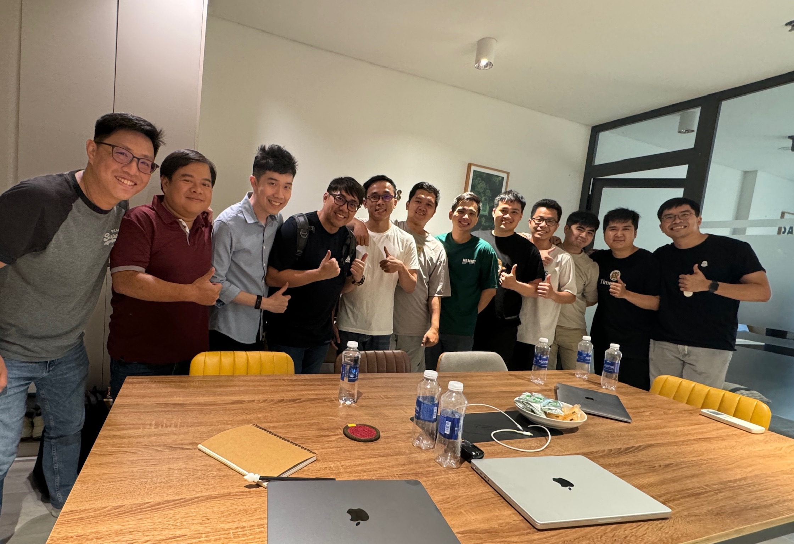

> “I believe that on the journey to becoming a Senior Software Engineer, the more you challenge yourself, the more interesting things become.”

**Life at Dwarves** this time is a rather secretive character in Dwarves with a healthy life and gentle personality. An Tran, Senior Software Engineer with 7 years of experience working from start-ups to Project Lead at Dwarves Foundation. 

Before joining Dwarves, An held the position of Tech Lead at a start-up and remote Frontend Lead for a company in the US. After giving himself 3 months of rest, An joined Dwarves' Gravity project, becoming a full-time engineer and lead builder of the project.

To An, things would become quite boring if they were only focused on Frontend. If you get too familiar with one fixed thing and don't expand into many other aspects, work will no longer be interesting. He has worked in many roles, from Android to Web, from Backend to Frontend. So the title Full-stack Engineer is somehow still true for this Senior. 

![[9e2ac4cd6681cdf0a45399021f20a4cd_MD5.webp]]

### What does it take for An to become a Senior?
If others need advice, I also give my own perspective and personal experience. I build trust with them, as that is how I leave an impact in my role as a guiding figure.

### How does being a Senior at Dwarves differ from previous companies?
“Each project comes with its own difficulties and responsibilities. I will have to find ways to adapt to the project and determine the approach to meet the client's requirements in any given environment.

During the initial phase of building Nghe Nhan system, our team had limited resources. The client's demands had to be balanced with the speed of delivery given the available resources. It was indeed a challenge. From planning and task allocation within the team to ensuring the quality of our work and the final product.

Nghe Nhan system is more complex than previous projects. I have to strike a balance between keeping up with the customer's pace as new features are continuously added. I need to ensure that the client understands that pushing for faster product development can sometimes be challenging in terms of maintaining quality. Working at Dwarves, especially in a senior role, presents various challenging scenarios for me to learn from and enhance my capabilities.”

### What is your opinion of a true Senior?
“I believe that I can learn a great deal from a genuine Senior. From task management, team communication, to problem-solving and providing solutions, there is much to gain. The clearest indication of working with a true Senior is the sense of comfort. They would be the first person I think of when encountering difficulties.“

### What are the important aspects that developers should learn if they want to become senior? 
“I think the criteria for recognizing a Senior can vary in each company. At Dwarves, Senior individuals would need to emphasize teamwork and team communication, as well as adopt a mindset of building products and viewing work from a holistic perspective. Personally, I believe that a Senior should actively acquire knowledge, build experience, and develop their own vision in product development.”

### Seniors can also make mistakes or create things that go unrecognized. Have you ever tried to get your work appreciated?
“To be honest, my intention when striving is not to seek recognition or high praise. It is based on the results I produce, delivering quality products that are effective. The evaluation is in the hands of others. I enjoy working on products, so my goal is to complete the product. In doing so, the outcome of the product becomes the measure of whether my output is good enough. If it falls short, I accept feedback and strive to improve it, not for the sake of recognition from others, but to make it better.”

### Dwarves is a fast-paced environment where things can get chaotic for Seniors who have many responsibilities. How do you manage your own tasks and teammates?
“I realize that leading someone who is fresh out of school can have a big impact on their career path. Working together for a long time, their working style may start to resemble mine, and even their code style may reflect my mindset. I believe that is how I leave an influence in my role as a trailblazer.

If you need advice or want to learn something specific or take additional courses to enhance your knowledge, I can provide you with my perspective. I share my insights and experiences based on what I have personally gone through. I won't share if I haven't experienced it myself. There's no secret formula, but I aim to build trust with you. Once you trust me, you'll be more inclined to listen to my advice”