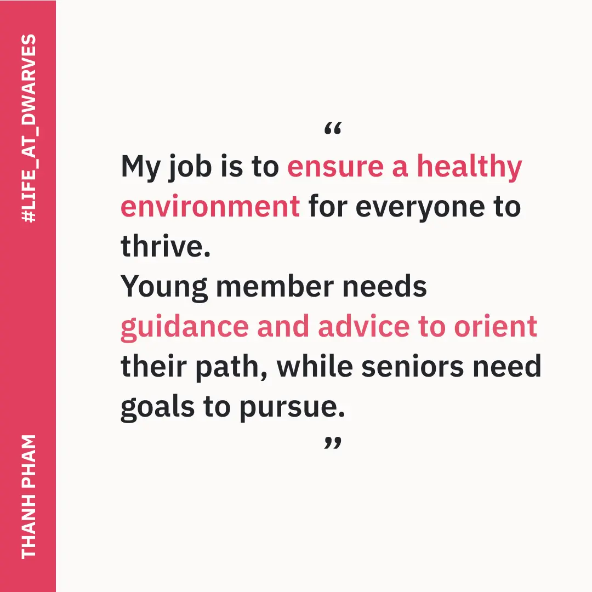
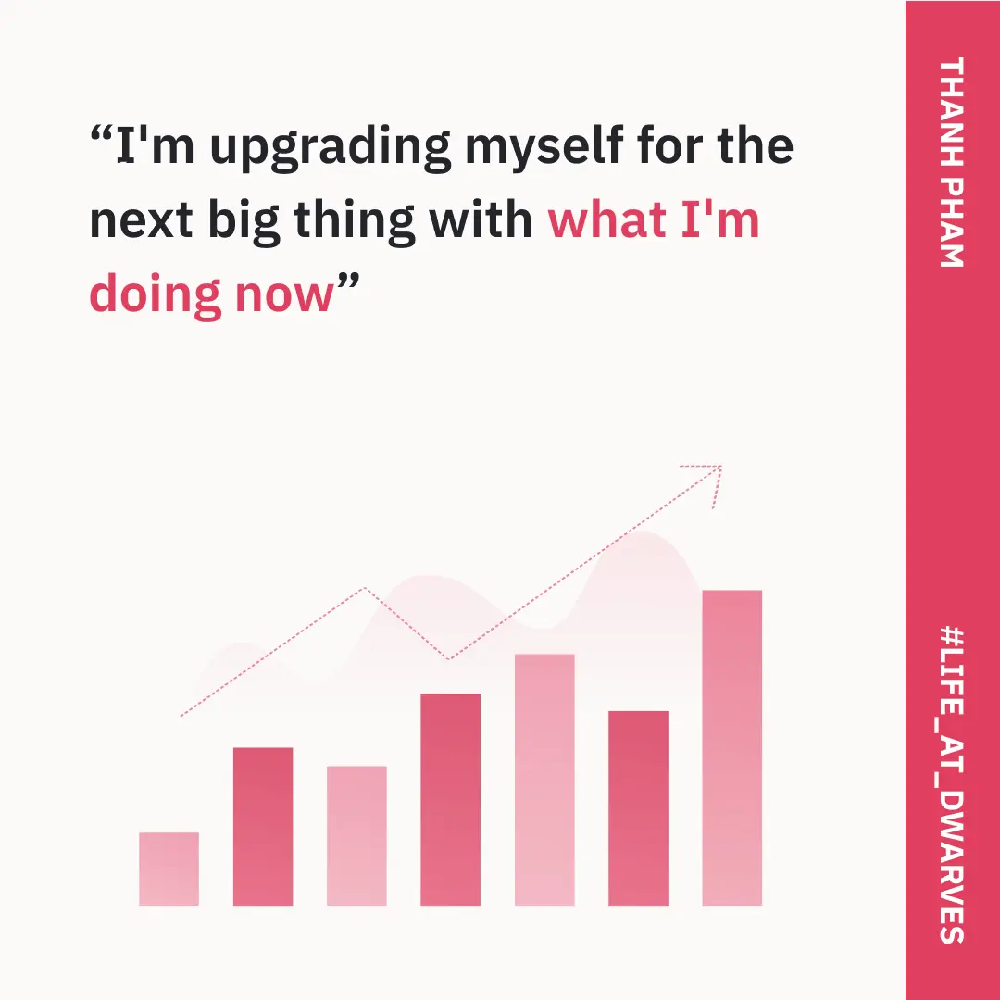

Been with us for nearly 5 years, Thanh has been taking care of the juniors and ensuring their progress goes alongside the company’s direction. He is also the co-host of Dwarves Radio Talk - our weekly tech training every Monday.

### My job is to ensure a healthy environment for everyone to thrive.
---

“I guide and train people if they are assigned to me. Dwarves Team has a 60-day Program to evaluate, and it usually is a 90-day plan, but based on the company size, the timeline can be adjusted to optimize its teammate growth.

Newbies can find it struggling to catch up. It happens for everyone - though their abilities are excellent. Hence, newbie tends to do whatever their leader instructs. We have a different approach for Dwarves Team. In this woodland, we encourage people to vision their goals and do what it takes to reach them. The target changes flexibly based on their goals and progress - from weekly check-ups, then monthly, and finally rounds up after 6 months.

It was quite an experience to mentor. Young member needs guidance and advice to orient their path, while seniors need goals to pursue.”

### Career path is built based on teammate’s expectation.
---

“Backed by Team Lead and Engineer Lead, we have 2 tracks for a career path. IC (Individual Contributor) and MT (Management Track). IC is built for teammates who find it challenging to fit in and wish to develop themselves individually. Meanwhile, MT is created for those who want to grow, socialize and work more with people.

At first, I didn't really enjoy sitting in a manager's seat. My focus was on developing the technical skills only. But in the long run, the Team should have someone to pay attention to, connect every teammate and navigate them based on one direction. So I fit in that slot, expanding the knowledge and encouraging everyone to interact and work well with each other. Time goes by, and here I am - in charging as an Engineer Manager.”

### The key for a stable product quality: Connecting the key roles.
---

“There are four key roles to deliver a good project outcome: Product Manager - who provides the answer for the "What"; Engineering Lead - who understands the "How"; Developer - who manages the deadline and connects all the joint of the codebase, and Engineer Manager - who allocates the right ones for the job. The solid collaboration of these fours forms a stable product quality.

I have conflicts to resolve too, either in the workload of the people. I once met a fresher who wanted to experience with startups. At that time, the company's demand was something different. One thing led to another, and he left. It's one of the problems you bump into once you're sitting at this place - It's to find the balance point between people's expectations and the company's direction.”
### Omw to becoming CTO.
---

“What makes this team stand out is their hustle. 

I rarely have to worry about the team being lazy. It's like a code of conduct here - People know how to use their time and get things done.

My future goal is to become a CTO, maybe in around 5-6 years - or sooner if I'm lucky. That requires working and understanding people, a lot. So I'm upgrading myself for the next big thing with what I'm doing now.”

