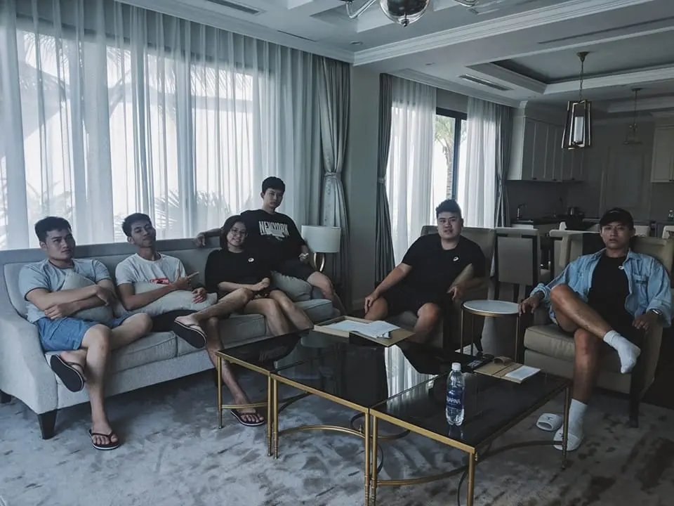

>
> "The process of transformation and progress will never be easy, but you need it for a better version".

**Life at Dwarves #5** is the career story of [@nam](https://github.com/namnhce), the Dwarves's DevOps Engineer. During 6 years turning from big corp to Dwarves Team, he lives upon the motto of constantly pushing himself above the limit. Listening to his sharing, we hope you might feel like we do, that Nam has always been and will be the key player who would strive to deliver his best.

### Joining Dwarves? A roller coaster ride.
"2017 marked my first milestone with Dwarves. One of my friends asked me if I wanted to be part of a team that worked on cool projects and surrounded by like-minded peeps. I said yes, without a second thought. Looking back now, it must have been fate. Because my 2017 version was still figuring out how to finish the university degree. Joining any firm as a full-time job can't be the right move.

I became a full-time FE after 4 months of part-time work. Dwarves didn't have any QC at that time besides Huy Tieu, and he became my mentor soon after that. I have worked in various engineering aspects, from Frontend to QC, Backend to DevOps. Until I joined Aharooms, where I finally decided to act as a Backend Engineer."

### Define. Grow. Complete.
"The peers my age tend to throw themselves into gym, movies or dining after work to blow off some steam. And they do that on a schedule. A schedule that I refuse to follow, mostly because I'm used to living as someone who prefers to do things alone. I find it hard to confine myself to meeting the same people, and doing the same thing on a specific timeline.

2019 was when I finally let myself try out new things in different settings. Staying at home too long shrinks my comfort zone, so I need to push myself out of it. That's when I signed up for GopherCon 2018 & 2019. The goal was not only to do another team thing but it also to observe and understand how a well-organized event works from A to Z.

The most intrigued aspect as an organizer is to take the initiative to work with merchandisers, contact and arrange the guest speaker's schedule. Thanks to those experiences, I was able to acknowledge what needs to be improved in my communication skill and was more open to expanding the social connection.

By that time, I was still one of the team's youngest members. So part of the motivation was to catch up with the rest of the group - those terrific in soft skills. Event-organizing work was how I practiced and grew to complete myself."

### The 200% motto.
"My trait of having an eye for details sometimes leads to slower productivity. Thus, I'm still today-year-old thriving to optimize it. While I was still working on Aharooms, staying up working until 1 or 2 AM was an everyday scheme. It bugs me to go to bed knowing I haven't finished the work. It's a principle to work with all I can, despite the role I'm playing as. Looking back at my 2017 version, I've always been amazed by what has been learned and changed.

Last July rounded up my 5th year as a Dwarves. It was one hell of a roller coaster ride. I play by a motto where I'm down to perform at a 200% effort. I guess that motto layers my success at Open Fabric, a recently-wrapped up project where the teammates and the Project Lead himself endorsed me for being an absolute rock star. It's hard to describe the feeling, but 'proud' would be the right word.

Dwarves is scaling up and getting bigger every day. So as a long-time contributor, the newbies would come and ask me how to upgrade their career and self-development. I often come with this: Give yourself the chance to try, and try out everything until you find something you wouldn't trade the world for. Keep up the consistency in what you choose. On top of that, don't force yourself to work on what you hate. Meeting new people will outgrow you. And remember to spend good times with the colleagues, because that can be one of the best moments you remember about that place."

---
**Life at Dwarves** is a series of stories about people, perspectives and lives at the Dwarves Foundation.
