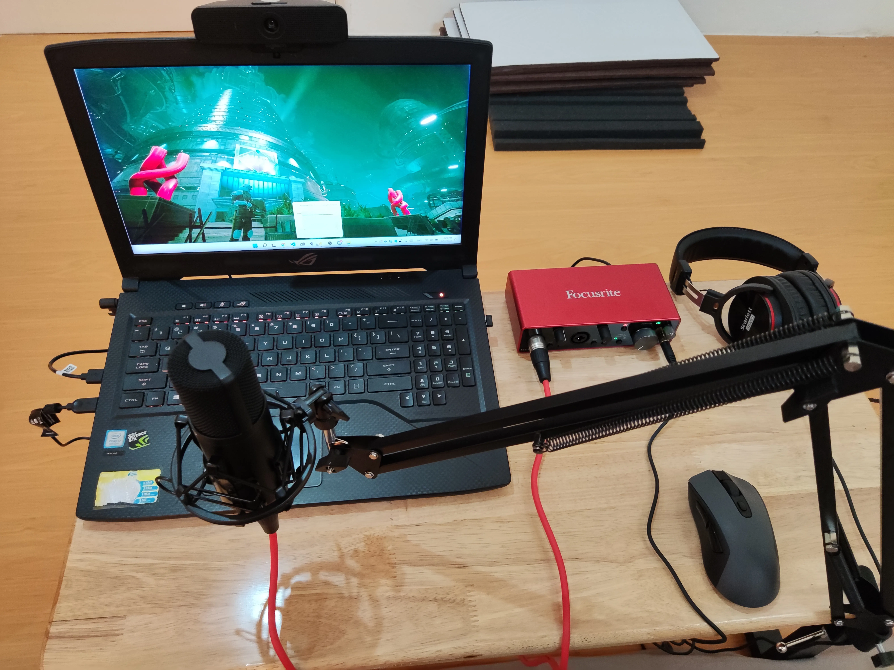
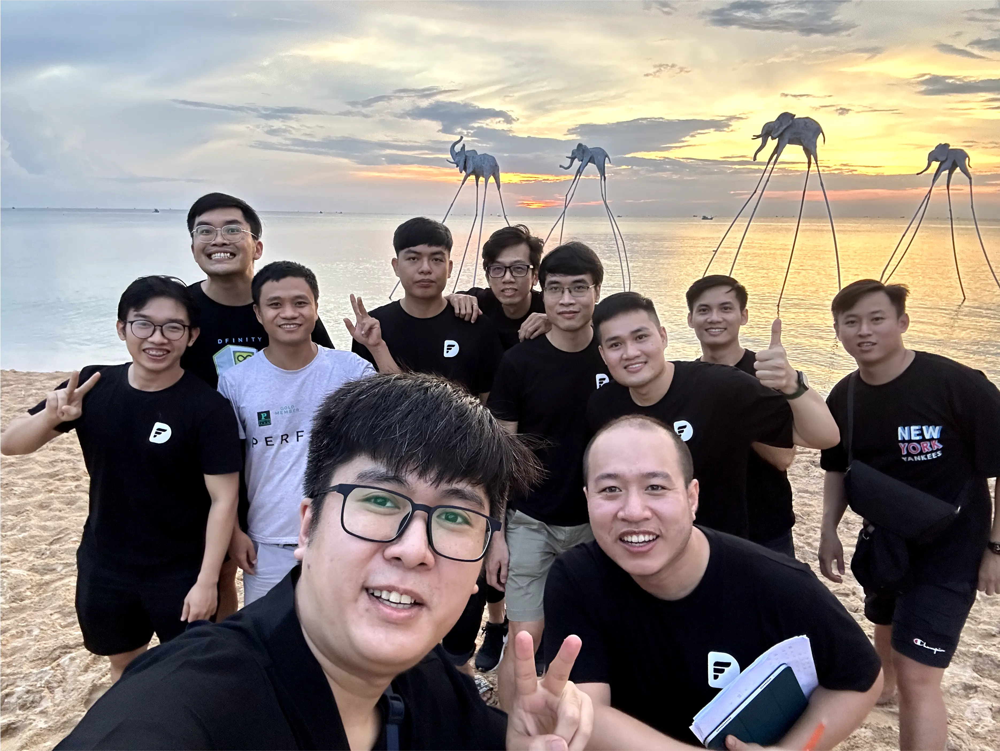

A catch-up with [@tom](https://memo.d.foundation/contributor/tom) - our Data Lead, and hear how remote working has fit him perfectly. Tom is one of our core contributors of Dwarves Brainery, and he'll be playing as a key mentor for our upcoming Apprenticeship.

>
> "The office creates a good vibe for work, but it also blocks us from having real work. Working from home allows you to have time for yourself and still get things done."

### Working remotely fits me well. It keeps me from distraction.
"I'm always at home, so WFH is awesome. My previous workplace required people to be at the office and hang out for drinks afterward, and it was a bit overwhelmed in my pov. Working remotely fits me well, and I get work done without being distracted.

Going to the office can make you focus on your work. But it's more enjoyable at home! We still catch up through casual talks or sync up for a few minutes to ensure the work is good. The office creates a good vibe for work, but it also blocks us from having real work. We somehow can be disrupted by tedious & lengthy meetings, food ordering, or random discussions.”

### If you need suport, just tell the team.
“I used to work for a Singapore firm that enabled me to work remotely from Vietnam. Ths working style has been a thing for me ever since. Working from home allows you to have time for yourself and still get things done. I can literally turn on the 4G and continue my work anywhere. And Dwarves Foundation gives teammates huge support for this. If you need equipment, just simply create a ticket. Whether it's a microphone, a webcam or an ergonomic chair, the team is willing to supply it if it backs you up.

### Remote working can significantly benefit when you use it wisely.
“Sometimes the people I work with don't feel so comfy working from home. In that case, I'll invite them to go out and try pair working, if we're lucky to live in the same city. I'm glad to help the mates adapt to this working culture because I know how remote working can significantly benefit when you use it wisely. In reverse, the team even reserves support costs for co-working space for the extroverted peeps.

In short, working from home only minimize our chances of verbal communication. It doesn't, and can't affect our work if you make it right. For me, it's the greatest work style ever. "

---
**Life at Dwarves** is a series of stories about people, perspectives and lives at the Dwarves Foundation.
