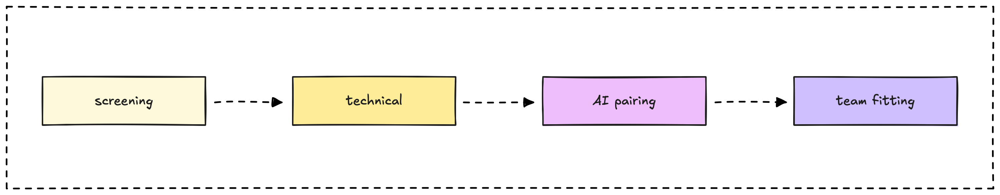

## We are hiring a comic artist & IP developer

Develop IP characters and visual storytelling that amplify our research-first brand. Create engaging comics, illustrations, and character-driven content that makes complex technical topics accessible while building strong community connection.

> **🤘 [Apply now](mailto:hr@d.foundation)** (We respond within three days)

## About Dwarves

Since 2015, we've been a research-focused technology firm that helps companies build top-notch software and invest in ambitious people pursuing world-changing innovations. We're profitable since day 1 and build our reputation through technical excellence and knowledge sharing.

Our approach to IP development focuses on **compound brand assets**: creating characters and stories that grow in value over time while making our technical expertise more engaging and memorable.

- [Life at Dwarves](/careers/life) • [The manifesto](/careers/manifesto) • [Culture handbook](/careers/culture)

Want to see our research-first approach in action? Explore our [memo site](https://memo.d.foundation) to understand how we build authority through knowledge sharing.

For inspiration on how IP characters can evolve across platforms, check out [Neko character development](https://sticker.console.so) - from stickers to comics to community engagement.

![[neko-sticker.png]]

## What you'll do

- **Develop IP characters**: Create and evolve character designs that embody our values of craftsmanship, technical excellence, and community spirit
- **Create visual storytelling**: Develop comics and illustrations that make complex technical topics (AI, blockchain, software engineering) accessible and engaging
- **Build brand consistency**: Establish visual style guides and character behaviors that work across all platforms (website, social media, presentations, conferences)
- **Support content strategy**: Collaborate with our growth and technical teams to create character-driven content that amplifies our research and insights
- **Engage community**: Design characters and stories that resonate with developers, engineers, and tech professionals while building emotional connection to our brand

## What we're looking for

**Comic and illustration expertise**

- 3+ years creating comics, graphic novels, or character-driven illustrations
- Strong portfolio demonstrating character development, storytelling, and visual consistency
- Experience with digital art tools and understanding of various output formats (web, print, social media)

**Brand and IP development skills**

- Understanding of how characters function as brand assets and marketing tools
- Experience developing character personalities, backstories, and visual evolution over time
- Ability to create style guides and maintain character consistency across different contexts

**Technical collaboration and learning**

- Interest in technology topics and ability to translate complex concepts into visual stories
- Comfortable working with technical teams to understand and illustrate software engineering concepts
- Willingness to learn about AI, blockchain, and emerging technologies to create accurate, engaging content

**Community and audience understanding**

- Understanding of developer and tech community culture, humor, and interests
- Experience creating content that resonates with technical audiences
- Ability to balance educational value with entertainment in visual storytelling

## What you can expect

- Create IP characters that become valuable, long-term brand assets for a profitable tech company
- Work with talented engineers and researchers to translate cutting-edge technology into engaging visual stories
- Build characters and stories that reach thousands of developers and tech professionals in our growing community
- Access to learning resources about technology trends to inform your creative work

## Our interview process

**Screening** • **Portfolio review** • **Character development exercise** • **Team interview** • **Offer**

**Portfolio review**\
Share your best character development work, comics, and examples of technical or educational illustration.

**Character development exercise**\
Create a character concept that could represent one of our technical values or community aspects.

**Team interview**\
Conversation about your creative process, collaboration with technical teams, and vision for character-driven brand building.

> **🤘 [Apply now](mailto:hr@d.foundation)** (We respond within three days)

---

## Your dream job not listed?

Not a big deal. We hardly ever say no to talents.

- [Shoot us an email](mailto:hr@d.foundation) with your LinkedIn / CV
- [Join our Discord](https://discord.gg/dfoundation) of +1200 other engineers and designers
