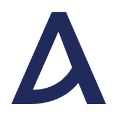
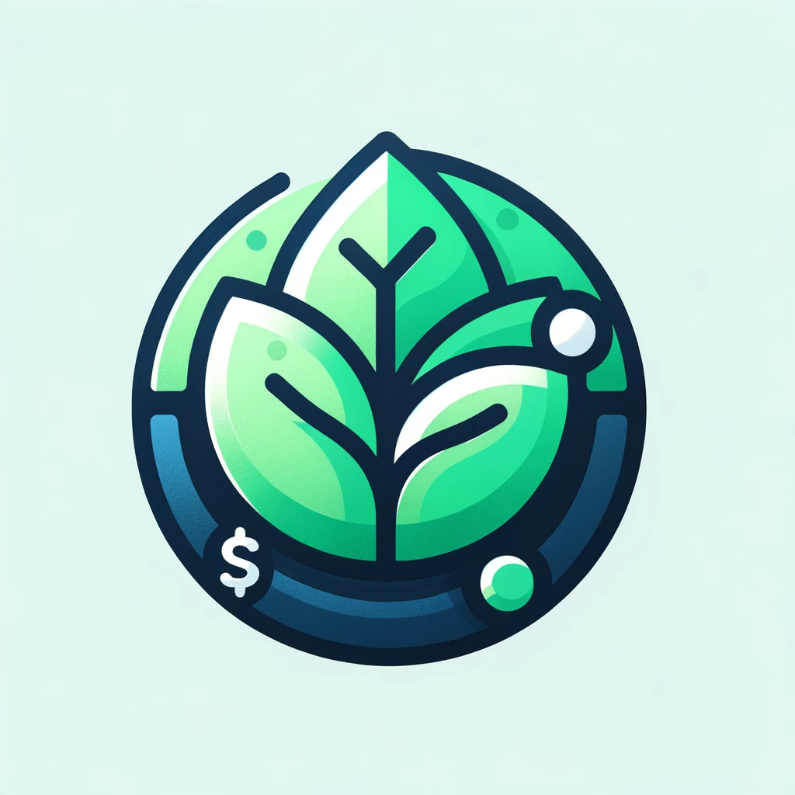
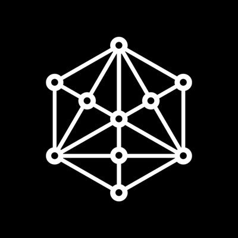

---
tags:
  - hiring
  - career
  - full-stack
  - engineer
title: Full-Stack Engineer
date: 2024-10-22
description: We are looking for a Full-Stack Engineer who is passionate about building scalable, secure, and efficient web applications. The ideal candidate will have a strong understanding of both frontend and backend technologies, and the ability to work across the entire stack.
authors:
  - minh
hiring: true
featured: true
---

## We are looking for a full-time contractor to take part in a fast growing web 3 project. This role offers flexibility, remote, independent work opportunities.

> **🤘 [Apply now](mailto:spawn@d.foundation)** (We respond within three days)

## Dwarves is a research-focused technology firm
Since 2015, we have helped companies build & ship top-notch software, operate tech teams and invest in ambitious people who are after world's next big things.

Technology is our north star metrics, engineering is our culture. We are a profitable company since day 1 and have been growing steadily.

By October, we have already achieved our goals set for 2021. Moving to the next goals, we're looking for talented engineers to join our team.

<table>
<tr>
<td width="33%">

### [Life at Dwarves](https://memo.d.foundation/careers/additional-info/life-at-dwarves/)

</td>
<td width="33%">

### [The Manifesto](https://memo.d.foundation/careers/additional-info/the-manifesto/)

</td>
<td width="33%">

### [Culture Handbook](https://memo.d.foundation/careers/additional-info/culture-handbook/)

</td>
</tr>
</table>

## Products we recently take part in

<table>
<tr>
<td width="33%">

### Ascenda
Ascenda enables financial services companies to grow revenue with world-class rewards
</td>
<td width="33%">

### Fornax AI
Fornax AI helps early-stage startup founders to effectively communicate their ideas to investors
</td>
<td width="33%">

### SP Group
Government owned utility distribution enterprise in Singapore, with footprint in most Asian countries and in Australia
</td>
</tr>
</table>

## Our advances into web 3.0

<table>
<tr>
<td width="33%">

### Attrace
Netherland's referral protocol for crypto assets where anyone can sign up to promote
</td>
<td width="33%">

### Hedge Foundation
Hedge Foundation - powerful dashboard to support users in managing crypto account positions, balance, PNL
</td>
<td width="33%">

### Tokenomy
Tokenomy - decentralized Community VC backed by the largest crypto exchange in Indonesia, Indodax
</td>
</tr>
</table> 

> 🤝 **As an engineer at Dwarves, you will be working closely with a team of talented, kind people and working directly with our clients. There is a lot of freedom to contribute to the quality of the project and improve, or prove yourself.**

### What you'll get to do
- Define and shape the fundamentals of engineering at Dwarves Foundation
- Design and write maintainable code at scale
- Continuously discuss, debate with other team members to propose optimal solutions for different problems
- Maintain and monitor the systems to make sure there is no disruption in our services

---
### What it takes to succeed
- A Linux or Mac user
- Familiar with Agile development process, esp. Scrum framework
- 3 years experience with Node JS
- Proficiency in **Node.js** and **Firebase**
- Strong understanding of **React**, **Vite**, **TypeScript**, and **Tailwind CSS**
- Experience in shipping web applications to production, CI/CD with docker centric workflow
- Familiar with running large scale web services
- Understanding of system performance and scaling
- Possess excellent communication, sharp analytical abilities with proven design skills, able to think critically of the current system regarding growth and stability
- Experience in writing good unit test
- Good written and verbal English communication, team player with a collaborative work ethics

---

### What you can look forward to
- You will be working closely with a team of talented, kind people. Your team will have your back. We love helping and uplifting our co-workers.
- You will be directly with our clients. There is a lot of freedom to contribute to the quality of the project and improve, or prove yourself.
- You will be working on projects that are impactful and meaningful. We're picky with what we choose to take part in.
- You will get to be a member of a community where we learn and discuss everything technology.

---

> 🤘 **[Apply now](mailto:spawn@d.foundation)** (We respond within three days)

**Your dream job not listed? Not a big deal. We hardly ever say no to talented people.**\
[Shoot us an email](mailto:spawn@d.foundation) with your LinkedIn / CV\
[Join our Discord](https://discord.gg/dwarvesv) of +300 other engineers and designers
