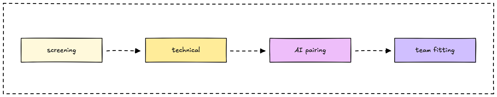

## We are hiring a sales manager

Lead sales execution for a research-first consulting firm. Take qualified opportunities identified by our business development team and convert them into signed contracts through expert deal-making and client relationship management.

> **🤘 [Apply now](mailto:hr@d.foundation)** (We respond within three days)

## About Dwarves

Since 2015, we've been a research-focused technology firm that helps companies build top-notch software and invest in ambitious people pursuing world-changing innovations. We're profitable since day 1 and build our reputation through technical excellence and knowledge sharing.

Our sales approach focuses on [**deal-making excellence**](/consulting/deal-making): guiding clients from unclear requirements to signed contracts while building trust and delivering clear value propositions.

[Life at Dwarves](/careers/life) • [The manifesto](/careers/manifesto) • [Culture handbook](/careers/culture)

Want to see our research-first approach in action? Explore our [memo site](https://memo.d.foundation) to understand how we build credibility through knowledge sharing.

## What you'll do

- **Execute deal-making process**: Guide clients from initial interest to signed contracts, clarifying requirements and building trust throughout
- **Manage client relationships**: Own the sales process from qualified leads to project kickoff, ensuring smooth handoff to delivery teams
- **Navigate negotiations**: Handle pricing discussions, scope negotiations, and contract terms to achieve win-win outcomes
- **Optimize sales process**: Track conversion metrics, identify bottlenecks, and improve deal velocity and success rates
- **Collaborate with technical teams**: Work with engineers to craft accurate proposals and communicate technical solutions effectively

## What we're looking for

**Sales experience**

- 3+ years in B2B sales, preferably in tech consulting or professional services
- Proven track record of converting leads into signed contracts
- Experience managing complex sales cycles and stakeholder relationships

**Technical collaboration skills**

- Comfortable working with engineers and technical teams to understand solutions
- Basic understanding of software development, AI, emerging technologies, or AI agents
- Experience selling technical solutions or consulting services

**Deal-making and process optimization**

- Strong negotiation and relationship-building abilities
- Experience handling unclear requirements and guiding clients to clarity
- Data-driven approach to tracking sales metrics and improving conversion rates
- Understanding of consulting engagement models and pricing strategies

## What you can expect

- Work with a profitable, research-first consulting firm with strong technical reputation
- Collaborate with talented engineers who can deliver on what you sell
- Sell cutting-edge solutions backed by real technical expertise and case studies
- Access to learning resources and industry events to stay current with sales best practices

## Our interview process

**Screening** • **Portfolio review** • **Sales simulation** • **Team interview** • **Offer**

**Portfolio review**\
Share examples of deals closed, sales processes improved, or client relationships developed.

**Sales simulation**\
Role-play a typical client scenario from unclear requirements to proposal presentation.

**Team interview**\
Conversation about collaboration with technical teams, sales philosophy, and approach to building client trust.

> **🤘 [Apply now](mailto:hr@d.foundation)** (We respond within three days)

---

## Your dream job not listed?

Not a big deal. We hardly ever say no to talents.

- [Shoot us an email](mailto:hr@d.foundation) with your LinkedIn / CV
- [Join our Discord](https://discord.gg/dfoundation) of +1200 other engineers and designers
